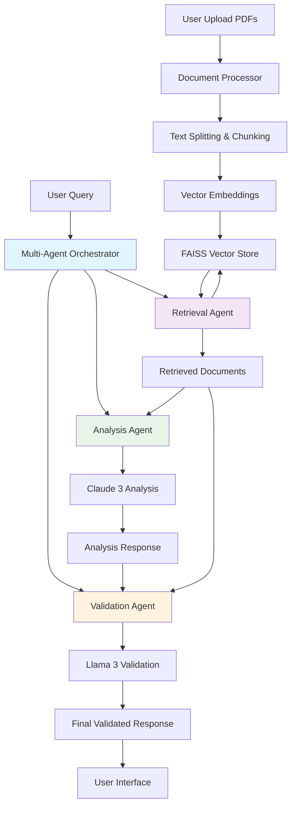
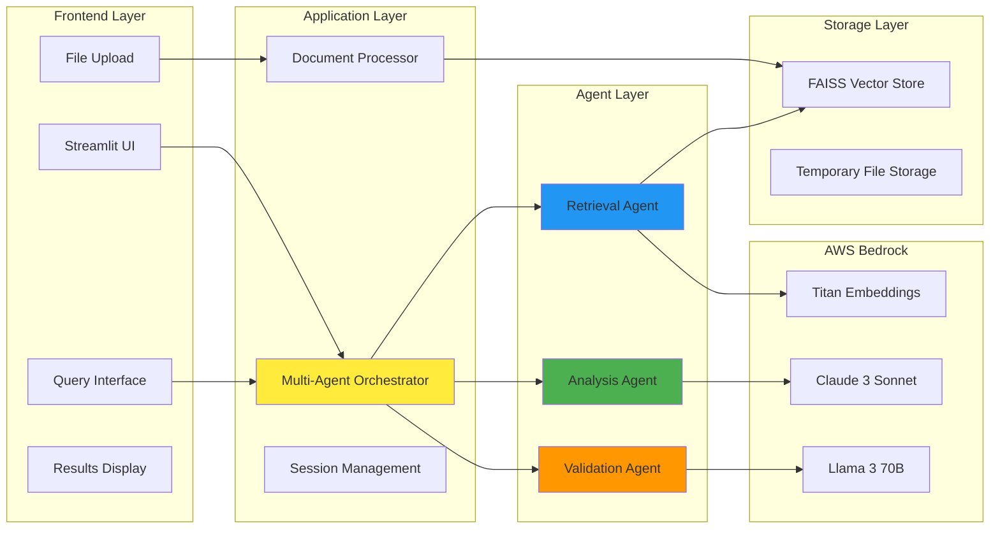

# 🧠 DocuMind AI

[](https://documentmindai.streamlit.app/)
[](https://www.python.org/downloads/)
[](LICENSE)
[](https://aws.amazon.com/bedrock/)

**DocuMind AI** is an intelligent multi-agent document analysis system that leverages AWS Bedrock's powerful AI models to provide comprehensive document insights through a collaborative agent architecture.

## 🌟 Features

- **Multi-Agent Architecture**: Specialized agents for retrieval, analysis, and validation
- **PDF Document Processing**: Upload and analyze multiple PDF documents simultaneously
- **Intelligent Retrieval**: Vector-based similarity search using FAISS
- **Advanced Analysis**: Powered by Claude 3 Sonnet for deep document understanding
- **Response Validation**: Cross-validation using Llama 3 70B for accuracy assurance
- **Real-time Processing**: Live progress tracking and performance metrics
- **Intuitive Interface**: Beautiful Streamlit-based UI with responsive design

## 🏗️ Architecture Overview

DocuMind AI implements a sophisticated multi-agent system where each agent specializes in a specific task:


```mermaid
graph TB
    A[User Upload PDFs] --> B[Document Processor]
    B --> C[Text Splitting & Chunking]
    C --> D[Vector Embeddings]
    D --> E[FAISS Vector Store]
    
    F[User Query] --> G[Multi-Agent Orchestrator]
    G --> H[Retrieval Agent]
    G --> I[Analysis Agent]
    G --> J[Validation Agent]
    
    H --> E
    E --> H
    H --> K[Retrieved Documents]
    
    K --> I
    I --> L[Claude 3 Analysis]
    L --> M[Analysis Response]
    
    M --> J
    K --> J
    J --> N[Llama 3 Validation]
    N --> O[Final Validated Response]
    
    O --> P[User Interface]
    
    style G fill:#e1f5fe
    style H fill:#f3e5f5
    style I fill:#e8f5e8
    style J fill:#fff3e0
```

### 🔧 System Components

#### 1. **Document Processor**
- **Purpose**: Handles PDF upload and preprocessing
- **Technology**: PyPDFLoader for extraction
- **Features**:
  - Multi-file processing
  - Metadata extraction
  - Error handling and validation

#### 2. **Retrieval Agent** 🔍
- **Model**: Amazon Titan Text Embeddings v2
- **Purpose**: Finds relevant document chunks
- **Process**:
  - Converts queries to vector embeddings
  - Performs similarity search in FAISS
  - Returns top-k relevant documents with scores

#### 3. **Analysis Agent** 🧠
- **Model**: Claude 3 Sonnet (anthropic.claude-3-sonnet-20240229-v1:0)
- **Purpose**: Provides comprehensive document analysis
- **Capabilities**:
  - Deep content understanding
  - Contextual question answering
  - Insight extraction and summarization

#### 4. **Validation Agent** ✅
- **Model**: Llama 3 70B Instruct (meta.llama3-70b-instruct-v1:0)
- **Purpose**: Validates analysis accuracy
- **Features**:
  - Cross-reference with source documents
  - Accuracy scoring (1-10 scale)
  - Confidence level assessment

#### 5. **Multi-Agent Orchestrator** 🎭
- **Purpose**: Coordinates the entire workflow
- **Process Flow**:
  1. Route query to Retrieval Agent
  2. Pass results to Analysis Agent
  3. Send analysis for validation
  4. Aggregate results and metrics

## 🏛️ Technical Architecture


```mermaid
graph LR
    subgraph "Frontend Layer"
        A[Streamlit UI]
        B[File Upload]
        C[Query Interface]
        D[Results Display]
    end
    
    subgraph "Application Layer"
        E[Multi-Agent Orchestrator]
        F[Document Processor]
        G[Session Management]
    end
    
    subgraph "Agent Layer"
        H[Retrieval Agent]
        I[Analysis Agent]
        J[Validation Agent]
    end
    
    subgraph "Storage Layer"
        K[FAISS Vector Store]
        L[Temporary File Storage]
    end
    
    subgraph "AWS Bedrock"
        M[Titan Embeddings]
        N[Claude 3 Sonnet]
        O[Llama 3 70B]
    end
    
    A --> E
    B --> F
    C --> E
    E --> H
    E --> I
    E --> J
    F --> K
    H --> M
    I --> N
    J --> O
    H --> K
    
    style E fill:#ffeb3b
    style H fill:#2196f3
    style I fill:#4caf50
    style J fill:#ff9800
```

## 🚀 Getting Started

### Prerequisites

- Python 3.8 or higher
- AWS Account with Bedrock access
- AWS CLI configured with appropriate credentials

### AWS Bedrock Model Access

Ensure you have access to the following models in AWS Bedrock:
- `amazon.titan-embed-text-v2:0`
- `anthropic.claude-3-sonnet-20240229-v1:0`
- `meta.llama3-70b-instruct-v1:0`

### Installation

1. **Clone the repository**
   ```bash
   git clone https://github.com/yourusername/documind-ai.git
   cd documind-ai
   ```

2. **Create virtual environment**
   ```bash
   python -m venv documind-env
   source documind-env/bin/activate  # On Windows: documind-env\Scripts\activate
   ```

3. **Install dependencies**
   ```bash
   pip install -r requirements.txt
   ```

4. **Configure AWS credentials**
   ```bash
   aws configure
   # Enter your AWS Access Key ID, Secret Access Key, and region (us-east-1)
   ```

### Running the Application

#### Local Development
```bash
streamlit run app.py
```

The application will be available at `http://localhost:8501`

#### Production Deployment
The app is deployed on Streamlit Cloud and accessible at:
**[DocuMind AI · Streamlit](https://documentmindai.streamlit.app/)**

## 📋 Usage Guide

### Step 1: Document Upload
1. Use the sidebar file uploader
2. Select one or more PDF files
3. Click "🚀 Process Documents"
4. Wait for processing completion

### Step 2: Query Documents
1. Enter your question in the main input field
2. Click "🔍 Analyze"
3. View the multi-agent processing progress
4. Review the comprehensive analysis

### Step 3: Explore Results
- **Main Analysis**: Primary response from Claude 3
- **Validation**: Quality check from Llama 3
- **Processing Details**: Performance metrics and statistics

## 🔧 Configuration

### Environment Variables
```bash
AWS_REGION=us-east-1
EMBED_MODEL_ID=amazon.titan-embed-text-v2:0
CLAUDE_MODEL_ID=anthropic.claude-3-sonnet-20240229-v1:0
LLAMA_MODEL_ID=meta.llama3-70b-instruct-v1:0
```

### Model Parameters
- **Embedding Dimensions**: 1024 (Titan v2)
- **Text Chunk Size**: 1000 characters
- **Chunk Overlap**: 200 characters
- **Max Tokens**: 1000 (Analysis), 500 (Validation)

## 📊 Performance Metrics

The system tracks various performance indicators:

- **Processing Time**: End-to-end query processing
- **Document Retrieval**: Number of relevant chunks found
- **Relevance Scores**: Similarity matching accuracy
- **Validation Scores**: Response quality assessment (1-10)

## 🛠️ Troubleshooting

### Common Issues

1. **AWS Credentials Error**
   ```
   Solution: Ensure AWS CLI is configured with valid credentials
   aws configure list
   ```

2. **Model Access Denied**
   ```
   Solution: Request access to Bedrock models in AWS Console
   Navigate to: AWS Bedrock → Model Access → Request Access
   ```

3. **PDF Processing Error**
   ```
   Solution: Ensure PDFs are not password-protected and under 10MB
   ```

4. **FAISS Index Error**
   ```
   Solution: Re-upload documents to rebuild the vector index
   ```

## 🧪 Testing

### Sample Test Queries
- "What are the main themes discussed in the document?"
- "Summarize the key findings and recommendations"
- "What are the limitations mentioned in the study?"
- "Extract all numerical data and statistics"

## 🤝 Contributing

1. Fork the repository
2. Create a feature branch (`git checkout -b feature/AmazingFeature`)
3. Commit your changes (`git commit -m 'Add some AmazingFeature'`)
4. Push to the branch (`git push origin feature/AmazingFeature`)
5. Open a Pull Request

## 📝 License

This project is licensed under the MIT License - see the [LICENSE](LICENSE) file for details.

## 🙏 Acknowledgments

- **AWS Bedrock** for providing state-of-the-art AI models
- **Streamlit** for the excellent web framework
- **LangChain** for the AI application framework
- **FAISS** for efficient vector similarity search

## 👨‍💻 Author

**Jay Zalani**

- GitHub: [@jayzalani](https://github.com/jayzalani)
- LinkedIn: [Jay Zalani](https://linkedin.com/in/jayzalani)

---

<p align="center">
Made with ❤️ by Jay Zalani
</p>

<p align="center">
<a href="https://documind-ai.streamlit.app/">🚀 Try DocuMind AI Live</a>
</p>
